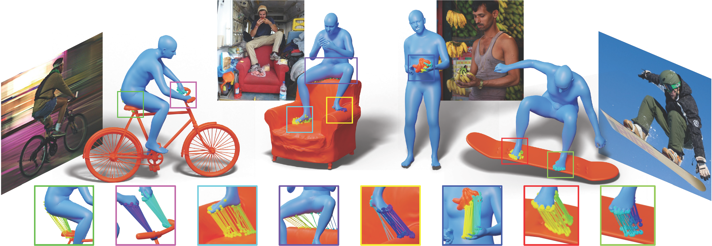

# PICO: Reconstructing 3D People In Contact with Objects [CVPR 2025]

> Code repository for the paper:  
> [**PICO: Reconstructing 3D People In Contact with Objects**](https://arxiv.org/abs/2504.17695)  
> [Alpár Cseke\*](https://is.mpg.de/person/acseke), [Shashank Tripathi\*](https://sha2nkt.github.io/), [Sai Kumar Dwivedi](https://saidwivedi.in/), [Arjun Lakshmipathy](https://www.andrew.cmu.edu/user/aslakshm/), [Agniv Chatterjee](https://ac5113.github.io/), [Michael J. Black](https://ps.is.mpg.de/person/black), [Dimitrios Tzionas](https://ps.is.mpg.de/person/dtzionas)<br />
> *Conference on Computer Vision and Pattern Recognition (CVPR), 2025* <br />
> \* equal contribution

[](https://arxiv.org/abs/2504.17695)  [](https://pico.is.tue.mpg.de/) [](https://pico.is.tue.mpg.de/dataexploration.html)



[[Project Page](https://pico.is.tue.mpg.de)] [[Paper](https://arxiv.org/abs/2504.17695)] [[Video]()] [[Poster](https://pico.is.tue.mpg.de/media/upload/static/images/CVPR2025_PICO_Poster.pdf)] [[License](https://pico.is.tue.mpg.de/license.html)] [[Contact](mailto:pico@tue.mpg.de)]

## News :triangular_flag_on_post:

- [2025/06/11] PICO-fit* optimization script is released!

## Installation and Setup
1. First, clone the repo. Then, we recommend creating a clean [conda](https://docs.conda.io/) environment, as follows:
```shell
git clone https://github.com/alparius/pico.git
cd pico
conda create -n pico python=3.10 -y
conda activate pico
```

2. Install packages:
```shell
pip install -r requirements.txt
```

3. Install PyTorch:
```shell
pip install torch torchvision torchaudio --index-url https://download.pytorch.org/whl/cu118
```
Please adjust the CUDA version as required.

4. Install PyTorch3D from source. Users may also refer to [PyTorch3D-install](https://github.com/facebookresearch/pytorch3d/blob/main/INSTALL.md) for more details.
However, our tests show that installing using ``conda`` sometimes runs into dependency conflicts.
Hence, users may alternatively install Pytorch3D from source.
```shell
pip install "git+https://github.com/facebookresearch/pytorch3d.git@stable"
```

<!-- 5. Install the SDF-based collision loss library:
- Put the `sdf` folder from [this repo](https://github.com/JiangWenPL/multiperson) under `src/utils/`
- in the `sdf/csrc/sdf_cuda.cpp` file, add:
```
    #ifndef AT_CHECK 
    #define AT_CHECK TORCH_CHECK 
    #endif
```
- run `python setup.py install` -->

6. Download some required files:
- run `sh fetch_static.sh` (see the script for details)
- download the smplx model files from [here](https://download.is.tue.mpg.de/download.php?domain=smplx&sfile=models_smplx_v1_1.zip). Put `SMPLX_NEUTRAL.npz` under `static/human_model_files/smplx/`

## Download the PICO-db dataset

Register an account on the [PICO website](https://pico.is.tue.mpg.de) to be able to access the subpage to download the dataset.

## Run the PICO-fit demo

```
python demo.py <folder_path_with_inputs> <folder_path_for_outputs>
```

## Citing
If you find this code useful for your research, please consider citing the following paper:

```bibtex
@inproceedings{cseke_tripathi_2025_pico,
    title     = {{PICO}: Reconstructing {3D} People In Contact with Objects},
    author    = {Cseke, Alp\'{a}r and Tripathi, Shashank and Dwivedi, Sai Kumar and Lakshmipathy, Arjun and Chatterjee, Agniv and Black, Michael J. and Tzionas, Dimitrios},
    booktitle = {Proceedings of the IEEE/CVF Conference on Computer Vision and Pattern Recognition (CVPR)},
    month     = {June},
    year      = {2025},
}
```

## License

See [LICENSE](LICENSE).

## Acknowledgments

We thank Felix Grüninger for advice on mesh preprocessing, Jean-Claude Passy and Valkyrie Felso for advice on the data collection, and Xianghui Xie for advice on HDM evaluation. We also thank Tsvetelina Alexiadis, Taylor Obersat, Claudia Gallatz, Asuka Bertler, Arina Kuznetcova, Suraj Bhor, Tithi Rakshit, Tomasz Niewiadomski, Valerian Fourel and Florentin Doll for their immense help in the data collection and verification process, Benjamin Pellkofer for IT support, and Nikos Athanasiou for the helpful discussions. This work was funded in part by the International Max Planck Research School for Intelligent Systems (IMPRS-IS). D. Tzionas is supported by the ERC Starting Grant (project STRIPES, 101165317).

Dimitris Tzionas has received a research gift fund from Google. While Michael J. Black is a co-founder and Chief Scientist at Meshcapade, his research in this project was performed solely at, and funded solely by, the Max Planck Society.

## Contact

For technical questions, please create an issue. For other questions, please contact `pico@tue.mpg.de`.

For commercial licensing, please contact `ps-licensing@tue.mpg.de`.
